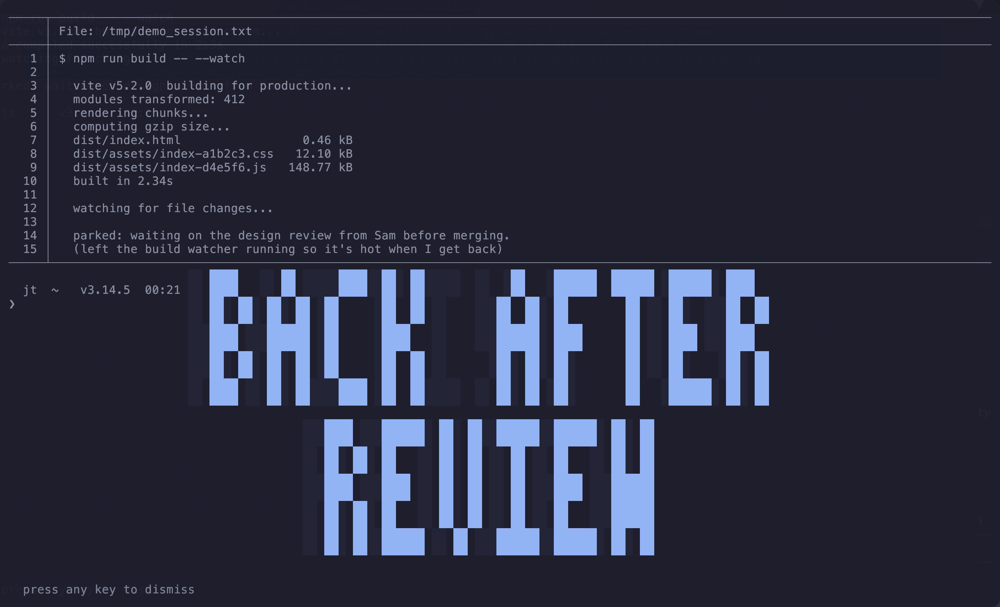

# kitty-tab-note

Leave a **big bold note over a "parked" [kitty](https://sw.kovidgoyal.net/kitty/) terminal tab** —
so when you come back you remember where you left off, or why the tab is still open.

You hit a key, type a short note, and a large coloured label appears low on the screen as an
overlay over that tab. The tab's existing text stays visible (slightly dimmed) behind the note.
Press any key to dismiss it and pick up where you were.



It's handy when you juggle several long-running terminal sessions (build watchers, REPLs,
AI coding agents, SSH sessions) and park some of them with a "come back to this" reason.

## Why a note overlay instead of the tab title?

Tab titles are short, get truncated, and are often overwritten by the running program. This
draws a **large** note right in the window where you can't miss it, without touching the title.

## Requirements

- **kitty** with remote control enabled. Add to `~/.config/kitty/kitty.conf` if not already:
  ```
  allow_remote_control yes
  listen_on unix:/tmp/kitty-{kitty_pid}
  ```
- **Python 3** (standard library only — no `pip install` needed).

## Install

```sh
git clone https://github.com/joet203/kitty-tab-note.git
cd kitty-tab-note
./install.sh
```

`install.sh` copies `tab-note.py` to `~/.config/kitty/` and adds a keybinding to your
`kitty.conf` (default **`ctrl+shift+p`** — mnemonic: "**p**ark this tab"). Then reload kitty
config (`ctrl+shift+f5`, or `kitty @ load-config`).

Or do it by hand — copy `tab-note.py` somewhere and add one line to `kitty.conf`:

```
map ctrl+shift+p launch --type=overlay --title "📌 note" python3 ~/.config/kitty/tab-note.py
```

## Use

- **Press `ctrl+shift+p`**, type a note, press Enter → the note appears over the tab.
- **Press any key** to dismiss it when you return.
- Or set a note non-interactively: `python3 tab-note.py "waiting on CI"`.

## Customise

Set environment variables (e.g. in the `launch` line via `--env NAME=VALUE`):

| Variable | Default | Meaning |
|---|---|---|
| `TABNOTE_COLOR` | `1;94` | ANSI SGR for the note (bold bright blue). e.g. `1;92` green, `1;95` magenta |
| `TABNOTE_DIM` | `0;2` | ANSI SGR for the background. `0` = not dimmed, `38;5;240` = heavily dimmed |
| `TABNOTE_SIZE` | `2` | Block scale, 1–4 (bigger = larger letters) |
| `TABNOTE_POS` | `bottom` | `bottom`, `middle`, or `top` |
| `TABNOTE_SIBLING_HINT` | _(unset)_ | If a tab has multiple windows, prefer the one whose command contains this string |

Example keybinding with a green, slightly larger, centred note:

```
map ctrl+shift+p launch --type=overlay --env TABNOTE_COLOR=1;92 --env TABNOTE_SIZE=3 --env TABNOTE_POS=middle python3 ~/.config/kitty/tab-note.py
```

## How it works

Terminal overlay windows can't be truly translucent, so for a *parked* tab the script:

1. Snapshots the tab's window text via `kitty @ get-text`.
2. Redraws that snapshot dimmed as the background.
3. Paints the note on top using a tiny built-in 3×5 **block font**, upscaled and drawn with
   `█` characters — leaving the letter gaps unpainted so the dimmed text shows through.

The background is a frozen snapshot from the moment you tag the tab, which is exactly right
for a tab you're parking (it isn't changing). It does **not** modify the running program.

## Notes / limitations

- The background snapshot is frozen, not live. For an actively-updating session you'd want a
  split pane instead of an overlay.
- The block font covers `A–Z 0–9` and common punctuation; notes are upper-cased when rendered.

## License

MIT — see [LICENSE](LICENSE).
